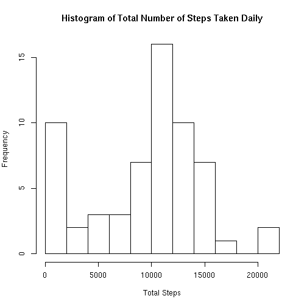
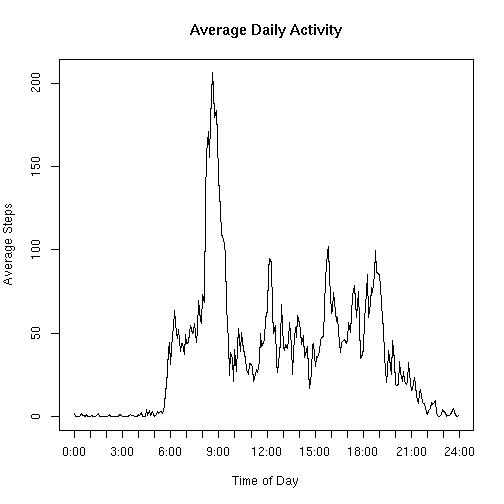
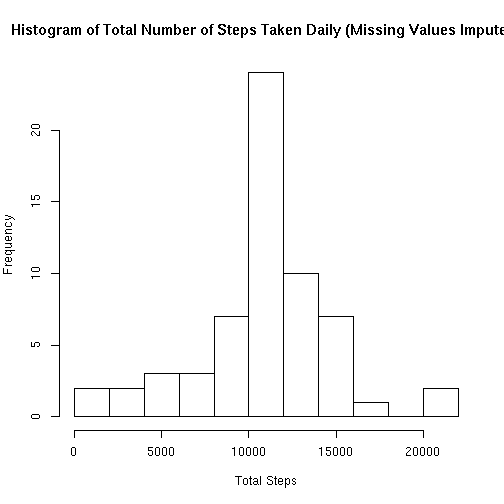
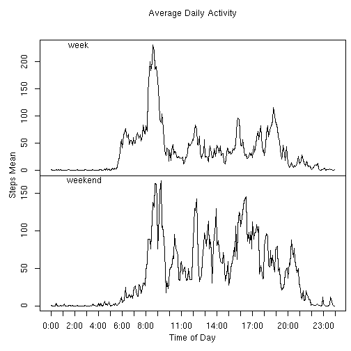

## Loading and preprocessing the data
The number of steps per 5 minute interval over two months is provided in the file activity.csv.

```r
library(dplyr)
library(lubridate)
stepsDf <- read.csv('activity.csv', stringsAsFactors = FALSE)
head(stepsDf)
```

```
##   steps       date interval
## 1    NA 2012-10-01        0
## 2    NA 2012-10-01        5
## 3    NA 2012-10-01       10
## 4    NA 2012-10-01       15
## 5    NA 2012-10-01       20
## 6    NA 2012-10-01       25
```

```r
steps <- tbl_df(stepsDf)
stepsByDay <- 	steps %>%  
				group_by(date) %>% 
				summarise(stepTotal = sum(steps, na.rm = TRUE))
hist(	stepsByDay$stepTotal, 
		breaks = 10, 
		main = "Histogram of Total Number of Steps Taken Daily",
		xlab = "Total Steps")
```



## What is mean total number of steps taken per day?

```r
mean(stepsByDay$stepTotal, na.rm = TRUE)
```

```
## [1] 9354.23
```

## What is median total number of steps taken per day?

```r
median(stepsByDay$stepTotal, na.rm = TRUE)
```

```
## [1] 10395
```

## What is the average daily activity pattern?

```r
stepsByInterval <- 	steps %>% 
					group_by(interval) %>%
					summarise(stepsMean = mean(steps, na.rm=TRUE)) %>%
					mutate(	t = sprintf('%04d', interval), 
							interval_t = paste(substr(t, 1, 2), substr(t, 3, 4), '00', sep = ':' ),
							tod = hms(interval_t))
with(stepsByInterval, plot(	x = tod, 
							y = stepsMean, 
							xaxt = 'n', 
							type = 'l', 
							main = 'Average Daily Activity',
							ylab = 'Average Steps',
							xlab = 'Time of Day'
							))
axis(side = 1, at = seq(0, 86400, 3600), labels = paste0(seq(0, 24, 1), ':00'))
```



## What is the interval that, on average, contains the maximum number of steps

```r
stepsByInterval[[which(stepsByInterval$stepsMean == max(stepsByInterval$stepsMean)), 'interval']]
```

```
## [1] 835
```


## Imputing missing values
### How many missing values are there?

```r
sum(is.na(stepsDf[,1]))
```

```
## [1] 2304
```
### Imputing strategy
The missing values in the original dataset are replaced with the mean of
the same interval across those observations that were not missing

```r
fullSteps <- 	merge(	steps, stepsByInterval,
						by.x='interval', by.y='interval') %>% 
				mutate(newsteps = ifelse(is.na(steps), stepsMean, steps))
newSteps <- fullSteps %>%
			select(steps = newsteps, date, interval) %>% 
			arrange(date, interval)
head(newSteps)
```

```
##       steps       date interval
## 1 1.7169811 2012-10-01        0
## 2 0.3396226 2012-10-01        5
## 3 0.1320755 2012-10-01       10
## 4 0.1509434 2012-10-01       15
## 5 0.0754717 2012-10-01       20
## 6 2.0943396 2012-10-01       25
```

### What does it look like now?

```r
stepsByDay <- 	newSteps %>%  
				group_by(date) %>% 
				summarise(stepTotal = sum(steps, na.rm = TRUE))
hist(	stepsByDay$stepTotal, 
		breaks = 10, 
		main = "Histogram of Total Number of Steps Taken Daily (Missing Values Imputed)",
		xlab = "Total Steps")
```



### What is mean total number of steps taken per day?

```r
mean(stepsByDay$stepTotal, na.rm = TRUE)
```

```
## [1] 10766.19
```

### What is median total number of steps taken per day?

```r
median(stepsByDay$stepTotal, na.rm = TRUE)
```

```
## [1] 10766.19
```
While it appears unusual that the mean and median are identical, there are a number 
of days that the steps value for every interval was missing. This imputing 
strategy resulted in those days having the mean sum of steps.
How many days does this affect?

```r
sum(stepsByDay[, 'stepTotal'] == mean(stepsByDay$stepTotal, na.rm = TRUE))
```

```
## [1] 8
```


### Are there differences in activity patterns between weekdays and weekends?
#### Create a factor with 2 values - week and weekend

```r
stepdays <- newSteps %>% 
				mutate(dow = weekdays(as.Date(date))) %>%
				mutate(dow = factor(dow, 
									levels = c(	"Monday", "Tuesday", "Wednesday", 
												"Thursday", "Friday", "Saturday", "Sunday"), 
									labels = c(	"week", "week", "week", "week", 
												"week", "weekend", "weekend"))) %>%
				group_by(interval, dow) %>%
				summarise(stepsMean = mean(steps, na.rm = TRUE)) 
stepsAsDf = as.data.frame(stepdays)
stepsAsDf <- 	stepsAsDf %>%	
				mutate(	t = sprintf('%04d', interval), 
						interval_t = paste(substr(t, 1, 2), substr(t, 3, 4), '00', sep = ':' ),
						tod = hms(interval_t))
par(mfrow = c(2,1), mar = c(0, 0, 0, 0), oma = c(4, 4, 4, 0.5))

with(stepsAsDf[which(stepsAsDf[,2] == 'week'),],
				plot(	x = tod, 
						y = stepsMean, 
						type = 'l', 
						xaxt = 'n',
						ylab = 'Average Steps',
						xlab = 'Time of Day'))
mtext('week', side = 3, line = -1, adj = 0.1)
#axis(side = 1, at = seq(0, 86400, 3600), labels = paste0(seq(0, 24, 1), ':00'))
with(stepsAsDf[which(stepsAsDf[,2] == 'weekend'),],
				plot(	x = tod, 
						y = stepsMean, 
						type = 'l', 
						xaxt = 'n',
						ylab = 'Average Steps',
						xlab = 'Time of Day'))
mtext('weekend', side = 3, line = -1, adj = 0.1)

axis(side = 1, at = seq(0, 86400, 3600), labels = paste0(seq(0, 24, 1), ':00'))
mtext("Time of Day", side = 1, outer = TRUE, line = 2.2)		
mtext("Steps Mean", side = 2, outer = TRUE, line = 2.2)		
mtext('Average Daily Activity', side = 3, outer = TRUE, line = 2.2)	
```



